# 📊 Documentation UML Complète - MITANEKO
## Plateforme de Gouvernance Participative Urbaine

---

## 📋 Table des matières

1. [Aperçu du système](#aperçu-du-système)
2. [Diagramme de cas d'usage](#diagramme-de-cas-dutilisation)
3. [Diagramme de classe](#diagramme-de-classe)
4. [Diagramme d'architecture](#diagramme-darchitecture)
5. [Modèle Entités-Relations (MER)](#modèle-entités-relations)
6. [Diagrammes de séquence](#diagrammes-de-séquence)
7. [Diagramme d'états](#diagramme-détats)
8. [Diagramme de composants](#diagramme-de-composants)
9. [Description détaillée des entités](#description-détaillée-des-entités)

---

## Aperçu du système

### Contexte général

**MITANEKO** est une plateforme web et mobile de gouvernance participative urbaine pour Madagascar. Elle permet aux citoyens de signaler des problèmes urbains, aux collectivités d'intervenir rapidement, et à la communauté de voter pour prioriser les actions.

### Objectifs fonctionnels

- 🗣️ Signalement participatif des problèmes urbains
- 🎯 Priorisation collaborative par vote
- 📋 Gestion des actions de résolution
- 💬 Discussion et engagement communautaire
- 📊 Analyse et tableaux de bord analytiques
- 👥 Gestion multi-rôles et multi-niveaux

### Niveaux d'organisation

```
Madagascar
  └─ Région
      └─ Commune (partenaire MITANEKO)
          └─ Quartiers
              └─ Citoyens
```

---

## Diagramme de cas d'utilisation

```mermaid
graph TB
    User["👤 Citoyen"]
    Mod["🛡️ Modérateur Quartier"]
    Actor["👨‍💼 Acteur Communal"]
    Elu["👔 Elu Commune"]
    Admin["⚙️ Admin Plateforme"]

    subgraph "Signalements"
        UC1["Créer un signalement"]
        UC2["Consulter les signalements"]
        UC3["Voter/Prioriser"]
        UC4["Commenter"]
    end

    subgraph "Modération"
        UC5["Approuver signalement"]
        UC6["Rejeter signalement"]
        UC7["Modérer commentaires"]
    end

    subgraph "Actions"
        UC8["Créer une action"]
        UC9["Suivre une action"]
        UC10["Mettre à jour progression"]
        UC11["Clôturer une action"]
    end

    subgraph "Analytiques"
        UC12["Consulter statistiques"]
        UC13["Générer rapports"]
        UC14["Analyser tendances"]
    end

    subgraph "Administration"
        UC15["Gérer utilisateurs"]
        UC16["Gérer communes/quartiers"]
        UC17["Configurer rôles"]
    end

    User -->|Crée, Consulte| UC1
    User -->|Vote & Commente| UC2
    User -->|Vote| UC3
    User -->|Commente| UC4
    User -->|Suit| UC9

    Mod -->|Approuve/Modère| UC5
    Mod -->|Modère| UC7
    Mod -->|Suit| UC9

    Actor -->|Crée & Suit| UC8
    Actor -->|Actualise| UC10
    Actor -->|Consulte| UC12

    Elu -->|Consulte| UC12
    Elu -->|Génère| UC13
    Elu -->|Consulte| UC14

    Admin -->|Administre| UC15
    Admin -->|Administre| UC16
    Admin -->|Administre| UC17
```

---

## Diagramme de classe

```mermaid
classDiagram
    class User {
        -id: UUID
        -email: String
        -nom: String
        -prenom: String
        -telephone: String
        -avatar_url: String
        -role: UserRole
        -commune_id: UUID
        -quartier_id: UUID
        -verified_email: Boolean
        -anonyme: Boolean
        -created_at: DateTime
        -updated_at: DateTime
        +register()
        +login()
        +updateProfile()
        +updatePreferences()
    }

    class UserRole {
        <<enumeration>>
        CITOYEN
        MODERATEUR_QUARTIER
        ACTEUR_COMMUNAL
        ELU_COMMUNE
        ADMIN_PLATEFORME
    }

    class Commune {
        -id: UUID
        -nom: String
        -slug: String
        -code_commune: String
        -region: String
        -localisation: Point(Geography)
        -maire_email: String
        -maire_telephone: String
        -contact_principal: Contact
        -statut_partenariat: String
        -date_lancement: Date
        -population_estimee: Integer
        -abonnement_niveau: String
        -created_at: DateTime
        -updated_at: DateTime
        +getSignalements()
        +getQuartiers()
        +getUtilisateurs()
        +getStatistiques()
    }

    class Quartier {
        -id: UUID
        -commune_id: UUID
        -nom: String
        -slug: String
        -description: String
        -localisation_polygone: Polygon(Geography)
        -localisation_centroide: Point(Geography)
        -population_estimee: Integer
        -zone_prioritaire: Boolean
        -created_at: DateTime
        -updated_at: DateTime
        +getSignalements()
        +getUtilisateurs()
        +getStatistiques()
    }

    class Signalement {
        -id: UUID
        -commune_id: UUID
        -quartier_id: UUID
        -creator_id: UUID
        -titre: String
        -description: String
        -categorie: CategorieProbleme
        -localisation: Point(Geography)
        -adresse: String
        -status: SignalementStatus
        -visibilite: String
        -priorite_votes: Integer
        -modere: Boolean
        -modere_par: UUID
        -date_moderation: DateTime
        -raison_rejet: String
        -photo_principale_url: String
        -created_at: DateTime
        -updated_at: DateTime
        +creer()
        +approuver()
        +rejeter()
        +comptabiliserVote()
        +mettrAJourStatut()
        +obtenerCommentaires()
    }

    class SignalementStatus {
        <<enumeration>>
        CREE
        APPROUVE
        EN_ATTENTE_VOTE
        PRIORISE
        EN_COURS
        RESOLU
        REJETE
        FERME
    }

    class CategorieProbleme {
        <<enumeration>>
        PROPRETE
        SECURITE
        INFRASTRUCTURE
        SANTE
        LIEN_SOCIAL
        AUTRE
    }

    class SignalementPhoto {
        -id: UUID
        -signalement_id: UUID
        -url: String
        -nom_fichier: String
        -taille_bytes: Integer
        -mime_type: String
        -position: Integer
        -uploaded_by: UUID
        -created_at: DateTime
        +uploader()
        +supprimer()
    }

    class Vote {
        -id: UUID
        -signalement_id: UUID
        -user_id: UUID
        -vote_type: String
        -created_at: DateTime
        +voter()
        +annulerVote()
    }

    class Action {
        -id: UUID
        -signalement_id: UUID
        -commune_id: UUID
        -titre: String
        -description: String
        -status: ActionStatus
        -equipe_responsable: String
        -responsable_id: UUID
        -date_cible: Date
        -date_debut: DateTime
        -date_fin: DateTime
        -budget_estime: Decimal
        -priorite: Integer
        -photo_avant_url: String
        -photo_apres_url: String
        -notes_progression: String
        -created_at: DateTime
        -updated_at: DateTime
        +creer()
        +demarrer()
        +progresser()
        +terminer()
        +obtenerSignalement()
    }

    class ActionStatus {
        <<enumeration>>
        ASSIGNEE
        EN_ATTENTE
        EN_COURS
        RESOLU
        ANNULEE
    }

    class Commentaire {
        -id: UUID
        -signalement_id: UUID
        -author_id: UUID
        -contenu: String
        -parent_id: UUID
        -type_commentaire: String
        -is_moderated: Boolean
        -is_archived: Boolean
        -created_at: DateTime
        -updated_at: DateTime
        +publier()
        +repondre()
        +moderer()
        +archiver()
    }

    class Evenement {
        -id: UUID
        -commune_id: UUID
        -quartier_id: UUID
        -titre: String
        -description: String
        -type_evenement: String
        -organisateur_id: UUID
        -date_debut: DateTime
        -date_fin: DateTime
        -localisation: Point(Geography)
        -adresse: String
        -nb_participants_estime: Integer
        -nb_participants_reel: Integer
        -statut: String
        -created_at: DateTime
        +creer()
        +planifier()
        +demarrer()
        +terminer()
        +inscrireParticipant()
    }

    class EvenementParticipant {
        -id: UUID
        -evenement_id: UUID
        -user_id: UUID
        -statut_participation: String
        -date_inscription: DateTime
        +sinscrire()
        +seDesinscrire()
        +confirmerParticipation()
    }

    class AnalyticsData {
        -id: UUID
        -commune_id: UUID
        -date: Date
        -nb_signalements_total: Integer
        -nb_signalements_crees: Integer
        -nb_signalements_resolus: Integer
        -nb_votes_total: Integer
        -categories_problemes: JSON
        -sentiments_citoyens: JSON
        -created_at: DateTime
        +calculer()
        +genererRapport()
    }

    User "1" --|> "1" UserRole
    User "1" --o "0..*" Signalement : crée
    User "1" --o "0..*" Vote : participe
    User "1" --o "0..*" Commentaire : écrit
    User "1" --o "0..*" Action : responsable
    User "1" --o "0..*" Evenement : organise
    User "0..*" -- "1" Commune : habite
    User "0..*" -- "1" Quartier : habite

    Commune "1" --|o "0..*" Quartier
    Commune "1" --|o "0..*" Signalement
    Commune "1" --|o "0..*" Action
    Commune "1" --|o "0..*" Evenement
    Commune "1" --|o "0..*" AnalyticsData

    Quartier "1" --|o "0..*" Signalement
    Quartier "1" --|o "0..*" Evenement

    Signalement "1" --|> "1" SignalementStatus
    Signalement "1" --|> "1" CategorieProbleme
    Signalement "1" --|o "0..*" SignalementPhoto
    Signalement "1" --|o "0..*" Vote
    Signalement "1" --|o "0..*" Commentaire
    Signalement "1" --|o "1" Action : genere

    Action "1" --|> "1" ActionStatus

    Commentaire "0..*" -- "0..*" Commentaire : repliques_a

    Evenement "1" --|o "0..*" EvenementParticipant
    EvenementParticipant "0..*" -- "1" User
```

---

## Diagramme d'architecture

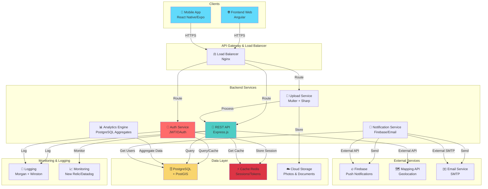

---

## Modèle Entités-Relations

```mermaid
graph LR
    subgraph "Core Entities"
        U["👤 users<br/>id, email, nom,<br/>prenom, role<br/>commune_id, quartier_id"]
        C["🏛️ communes<br/>id, nom, slug<br/>region, localisation<br/>maire_email"]
        Q["🏘️ quartiers<br/>id, commune_id<br/>nom, slug<br/>localisation_polygone"]
    end

    subgraph "Signalement Flow"
        S["🚨 signalements<br/>id, commune_id<br/>quartier_id, creator_id<br/>titre, description<br/>categorie, status"]
        SP["📸 signalement_photos<br/>id, signalement_id<br/>url, nom_fichier"]
        V["👍 votes<br/>id, signalement_id<br/>user_id, vote_type"]
        COM["💬 commentaires<br/>id, signalement_id<br/>author_id, contenu<br/>parent_id"]
    end

    subgraph "Action Flow"
        A["✅ actions<br/>id, signalement_id<br/>commune_id, titre<br/>status, responsable_id<br/>date_cible, date_fin"]
    end

    subgraph "Community"
        E["📅 evenements<br/>id, commune_id<br/>quartier_id, titre<br/>date_debut, localisation"]
        EP["👥 evenement_participants<br/>id, evenement_id<br/>user_id, statut_participation"]
    end

    subgraph "Analytics"
        AD["📊 analytics_data<br/>id, commune_id<br/>date, nb_signalements<br/>categorie_stats"]
    end

    U -->|habite| C
    U -->|habite| Q
    U -->|crée| S
    U -->|vote pour| V
    U -->|commente| COM
    U -->|responsable| A
    U -->|organise| E
    U -->|participe| EP

    C --|peut avoir| Q
    C --|génère| S
    C --|crée| A
    C --|organise| E
    C --|génère| AD

    Q --|contient| S
    Q --|contient| E

    S --|a| SP
    S --|reçoit| V
    S --|reçoit| COM
    S --|génère| A

    E --|a| EP

    style U fill:#e1f5ff
    style C fill:#fff3e0
    style Q fill:#f3e5f5
    style S fill:#ffe0b2
    style A fill:#c8e6c9
    style E fill:#f1f8e9
    style AD fill:#ede7f6
```

---

## Diagrammes de séquence

### 1️⃣ Flux de création et priorisation d'un signalement

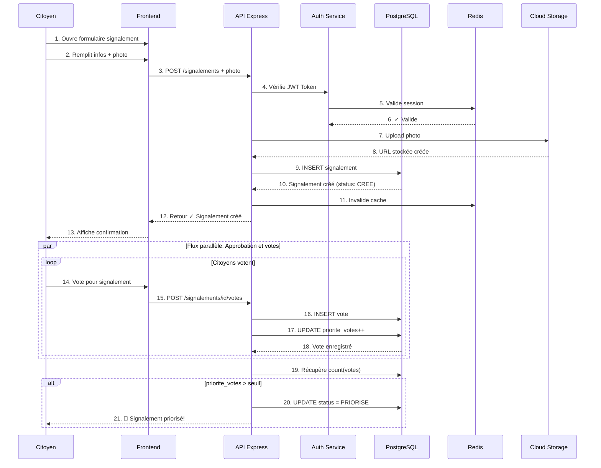

### 2️⃣ Flux de création et suivi d'une action

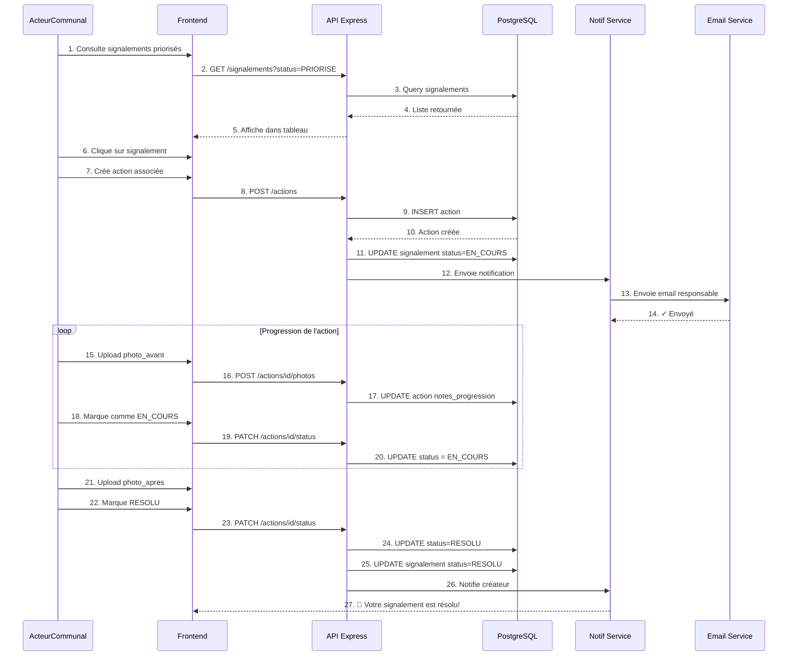

### 3️⃣ Flux d'authentification et autorisation

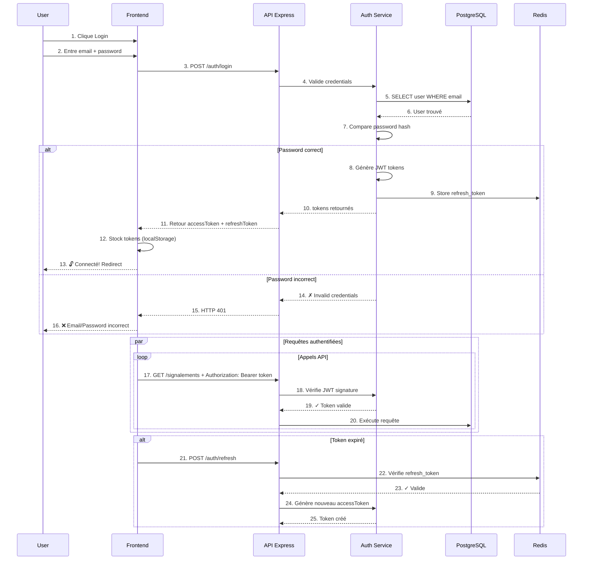

### 4️⃣ Flux de modération et commentaires

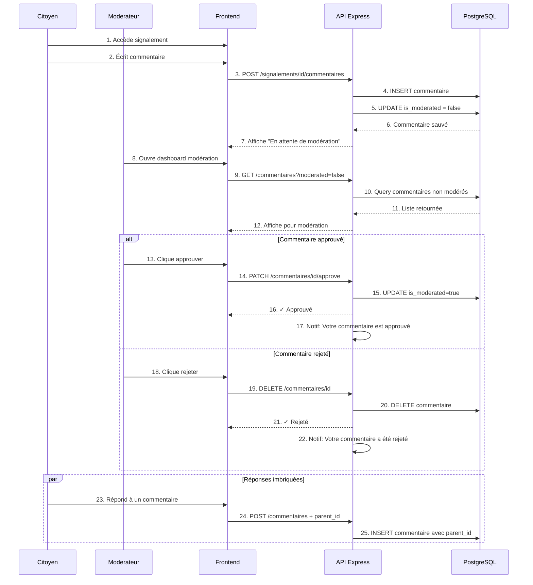

---

## Diagramme d'états

### Cycle de vie d'un signalement

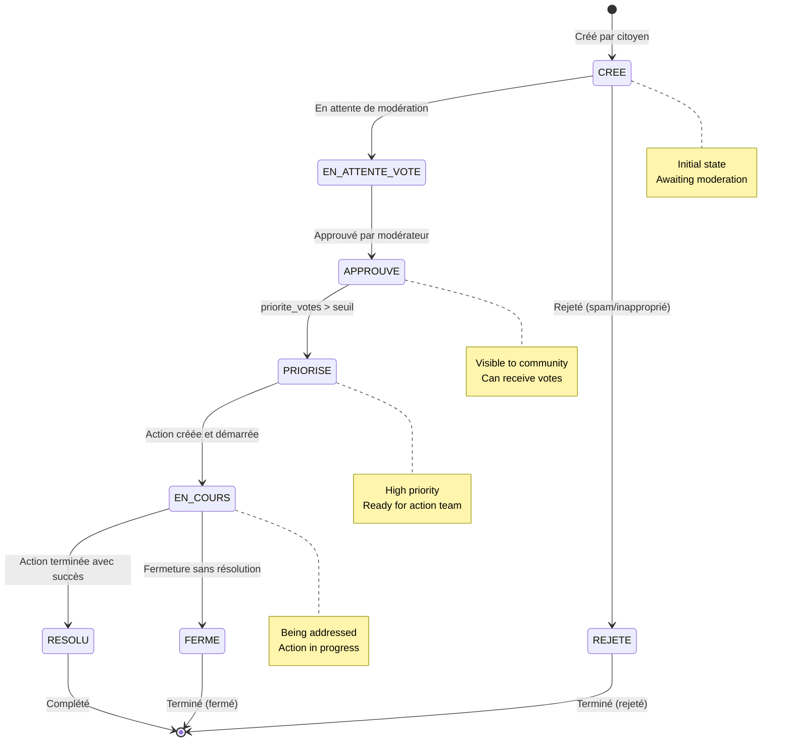

### Cycle de vie d'une action

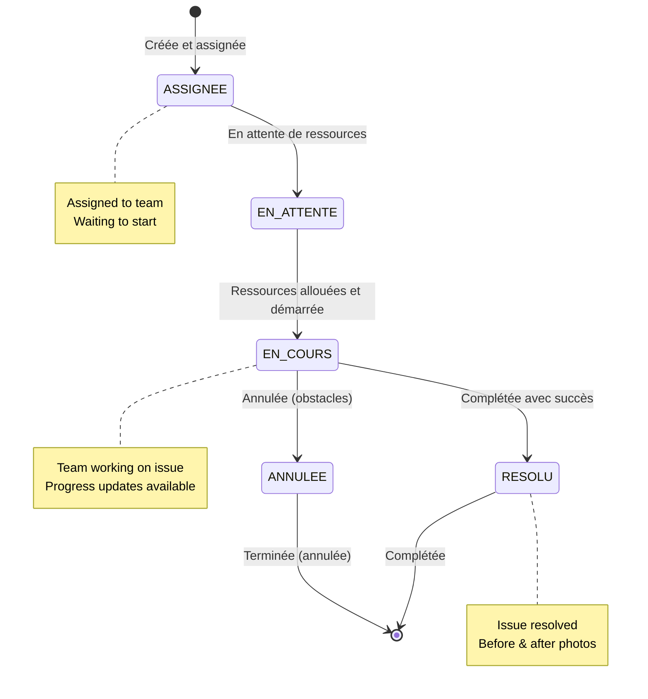

---

## Diagramme de composants

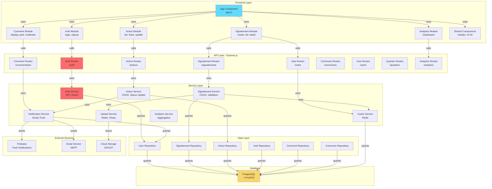

---

## Description détaillée des entités

### 1. **User (Utilisateur)**

| Propriété | Type | Description |
|-----------|------|-------------|
| `id` | UUID | Identifiant unique (PK) |
| `email` | VARCHAR(255) | Email unique |
| `nom` | VARCHAR(255) | Nom de famille |
| `prenom` | VARCHAR(255) | Prénom |
| `telephone` | VARCHAR(20) | Numéro de téléphone optionnel |
| `password_hash` | VARCHAR(255) | Hash sécurisé du mot de passe |
| `avatar_url` | TEXT | URL de la photo de profil |
| `role` | user_role | Rôle de l'utilisateur (enum) |
| `commune_id` | UUID (FK) | Commune d'appartenance |
| `quartier_id` | UUID (FK) | Quartier d'appartenance |
| `bio` | TEXT | Biographie/Description |
| `verified_email` | BOOLEAN | Email vérifié |
| `verified_telephone` | BOOLEAN | Téléphone vérifié |
| `anonyme` | BOOLEAN | Participe anonymement |
| `preferences_notifications` | JSONB | Préférences de notifications |
| `dernier_acces` | TIMESTAMP | Dernier accès à la plateforme |
| `status_compte` | VARCHAR(50) | Statut du compte (actif, suspendu, etc) |
| `created_at` | TIMESTAMP | Date de création |
| `updated_at` | TIMESTAMP | Date de dernière modification |

**Rôles disponibles:**
- 🟢 `citoyen` - Utilisateur standard
- 🟡 `moderateur_quartier` - Modère les signalements du quartier
- 🟠 `acteur_communal` - Crée et suit les actions
- 🔴 `elu_commune` - Accès aux statistiques et rapports
- ⚫ `admin_plateforme` - Gestion complète

---

### 2. **Commune**

| Propriété | Type | Description |
|-----------|------|-------------|
| `id` | UUID | Identifiant unique (PK) |
| `nom` | VARCHAR(255) | Nom de la commune |
| `slug` | VARCHAR(255) | Slug pour URL |
| `code_commune` | VARCHAR(50) | Code administratif |
| `region` | VARCHAR(255) | Région administrative |
| `localisation` | GEOGRAPHY(POINT) | Coordonnées GPS de la commune |
| `maire_email` | VARCHAR(255) | Email du maire |
| `maire_telephone` | VARCHAR(20) | Téléphone du maire |
| `contact_principal` | MAP | Contact principal |
| `statut_partenariat` | VARCHAR(50) | Statut du partenariat |
| `date_lancement` | DATE | Date de lancement sur MITANEKO |
| `abonnement_niveau` | VARCHAR(50) | Niveau d'abonnement (basic, pro, enterprise) |
| `population_estimee` | INTEGER | Population estimée |
| `nb_quartiers` | INTEGER | Nombre de quartiers |
| `created_at` | TIMESTAMP | Date de création |
| `updated_at` | TIMESTAMP | Date de modification |
| `is_active` | BOOLEAN | Commune active |

---

### 3. **Quartier**

| Propriété | Type | Description |
|-----------|------|-------------|
| `id` | UUID | Identifiant unique (PK) |
| `commune_id` | UUID (FK) | Commune parente |
| `nom` | VARCHAR(255) | Nom du quartier |
| `slug` | VARCHAR(255) | Slug pour URL |
| `description` | TEXT | Description du quartier |
| `localisation_polygone` | GEOGRAPHY(POLYGON) | Limites du quartier |
| `localisation_centroide` | GEOGRAPHY(POINT) | Centre du quartier |
| `population_estimee` | INTEGER | Population estimée |
| `zone_prioritaire` | BOOLEAN | Zone prioritaire d'intervention |
| `created_at` | TIMESTAMP | Date de création |
| `updated_at` | TIMESTAMP | Date de modification |
| `is_active` | BOOLEAN | Quartier actif |

---

### 4. **Signalement**

| Propriété | Type | Description |
|-----------|------|-------------|
| `id` | UUID | Identifiant unique (PK) |
| `commune_id` | UUID (FK) | Commune concernée |
| `quartier_id` | UUID (FK) | Quartier concerné |
| `creator_id` | UUID (FK) | Utilisateur créateur |
| `titre` | VARCHAR(200) | Titre du signalement |
| `description` | TEXT | Description détaillée |
| `categorie` | categorie_probleme | Catégorie (enum) |
| `localisation` | GEOGRAPHY(POINT) | Coordonnées GPS |
| `adresse` | VARCHAR(500) | Adresse textuelle |
| `status` | signalement_status | Statut du signalement (enum) |
| `visibilite` | VARCHAR(50) | Public ou anonyme |
| `priorite_votes` | INTEGER | Nombre de votes reçus |
| `modere` | BOOLEAN | Signalement modéré |
| `modere_par` | UUID (FK) | Modérateur responsable |
| `date_moderation` | TIMESTAMP | Date de la modération |
| `raison_rejet` | TEXT | Raison si rejeté |
| `date_resolution` | TIMESTAMP | Date de résolution |
| `photo_principale_url` | TEXT | URL de la photo principale |
| `created_at` | TIMESTAMP | Date de création |
| `updated_at` | TIMESTAMP | Date de modification |
| `is_archived` | BOOLEAN | Signalement archivé |

**Catégories:**
- 🧹 `proprete` - Propreté urbaine
- 🛡️ `securite` - Sécurité publique
- 🏗️ `infrastructure` - Infrastructure
- 🏥 `sante` - Santé publique
- 🤝 `lien_social` - Lien social
- ❓ `autre` - Autre

---

### 5. **Vote**

| Propriété | Type | Description |
|-----------|------|-------------|
| `id` | UUID | Identifiant unique (PK) |
| `signalement_id` | UUID (FK) | Signalement voté |
| `user_id` | UUID (FK) | Utilisateur votant |
| `vote_type` | VARCHAR(50) | Type de vote ('positif') |
| `created_at` | TIMESTAMP | Date du vote |

**Contrainte:** Unique(signalement_id, user_id) - Un utilisateur ne peut voter qu'une fois par signalement

---

### 6. **Action**

| Propriété | Type | Description |
|-----------|------|-------------|
| `id` | UUID | Identifiant unique (PK) |
| `signalement_id` | UUID (FK) | Signalement associé |
| `commune_id` | UUID (FK) | Commune responsable |
| `titre` | VARCHAR(255) | Titre de l'action |
| `description` | TEXT | Description détaillée |
| `status` | action_status | Statut de l'action (enum) |
| `equipe_responsable` | VARCHAR(255) | Nom de l'équipe |
| `responsable_id` | UUID (FK) | Chef de projet assigné |
| `date_cible` | DATE | Date cible de résolution |
| `date_debut` | TIMESTAMP | Date de début réelle |
| `date_fin` | TIMESTAMP | Date de fin réelle |
| `ressources_allouees` | VARCHAR(500) | Ressources dédiées |
| `budget_estime` | DECIMAL(10,2) | Budget estimé |
| `priorite` | INTEGER | Niveau de priorité |
| `photo_avant_url` | TEXT | Photo avant intervention |
| `photo_apres_url` | TEXT | Photo après intervention |
| `notes_progression` | TEXT | Notes de progression |
| `created_at` | TIMESTAMP | Date de création |
| `updated_at` | TIMESTAMP | Date de modification |
| `created_by` | UUID (FK) | Créateur de l'action |

**Statuts:**
- 📝 `assignee` - Assignée
- ⏳ `en_attente` - En attente de ressources
- 🔄 `en_cours` - En cours
- ✅ `resolu` - Résolue
- ❌ `annulee` - Annulée

---

### 7. **Commentaire**

| Propriété | Type | Description |
|-----------|------|-------------|
| `id` | UUID | Identifiant unique (PK) |
| `signalement_id` | UUID (FK) | Signalement commenté |
| `author_id` | UUID (FK) | Auteur du commentaire |
| `contenu` | TEXT | Contenu du commentaire |
| `parent_id` | UUID (FK) | Commentaire parent (imbrication) |
| `type_commentaire` | VARCHAR(50) | Type (général, suggestion, etc) |
| `is_moderated` | BOOLEAN | Modéré et approuvé |
| `is_archived` | BOOLEAN | Commentaire archivé |
| `created_at` | TIMESTAMP | Date de création |
| `updated_at` | TIMESTAMP | Date de modification |

---

### 8. **Événement**

| Propriété | Type | Description |
|-----------|------|-------------|
| `id` | UUID | Identifiant unique (PK) |
| `commune_id` | UUID (FK) | Commune organisatrice |
| `quartier_id` | UUID (FK) | Quartier concerné |
| `titre` | VARCHAR(255) | Titre de l'événement |
| `description` | TEXT | Description |
| `type_evenement` | VARCHAR(100) | Type d'événement |
| `organisateur_id` | UUID (FK) | Organisateur |
| `date_debut` | TIMESTAMP | Date de début |
| `date_fin` | TIMESTAMP | Date de fin |
| `localisation` | GEOGRAPHY(POINT) | Localisation GPS |
| `adresse` | VARCHAR(500) | Adresse textuelle |
| `nb_participants_estime` | INTEGER | Participants estimés |
| `nb_participants_reel` | INTEGER | Participants réels |
| `statut` | VARCHAR(50) | Statut (planifié, en cours, terminé) |
| `created_at` | TIMESTAMP | Date de création |
| `updated_at` | TIMESTAMP | Date de modification |

---

### 9. **AnalyticsData**

| Propriété | Type | Description |
|-----------|------|-------------|
| `id` | UUID | Identifiant unique (PK) |
| `commune_id` | UUID (FK) | Commune analysée |
| `date` | DATE | Date de la métrique |
| `nb_signalements_total` | INTEGER | Total signalements |
| `nb_signalements_crees` | INTEGER | Nouveaux signalements du jour |
| `nb_signalements_resolus` | INTEGER | Signalements résolus du jour |
| `nb_votes_total` | INTEGER | Total des votes |
| `categories_problemes` | JSON | Distribution par catégorie |
| `sentiments_citoyens` | JSON | Analyse du sentiment |
| `taux_resolution` | DECIMAL(5,2) | Pourcentage de résolution |
| `created_at` | TIMESTAMP | Date de création |

---

## 🔐 Sécurité & Autorisation

### Niveau d'accès par rôle

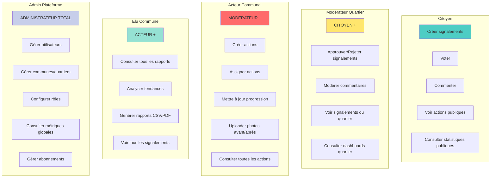

---

## 🌐 Intégrations Externes

### Services tiers utilisés

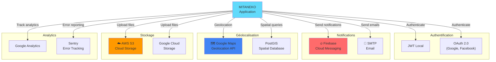

---

## 📊 Schéma Logique des Données

### Flux de données principal

```
┌─────────────────────────────────────────────────────────────────┐
│                         CITOYEN SIGNALE                          │
└──────────────────────────┬──────────────────────────────────────┘
                           │
                    ┌──────▼──────┐
                    │ Signalement  │
                    │  (CREE)      │
                    └──────┬───────┘
                           │
              ┌────────────┼────────────┐
              │            │            │
        ┌─────▼┐      ┌────▼────┐  ┌──▼────┐
        │Photo │      │Comments │  │ Modera│
        │      │      │         │  │ tion  │
        └──────┘      └────┬────┘  └──┬────┘
                           │          │
                           │    ┌─────▼──────┐
                           │    │ APPROUVÉ   │
                           │    └─────┬──────┘
                           │          │
              ┌────────────┴──────────┤
              │                       │
         ┌────▼────┐          ┌──────▼────┐
         │  VOTES  │          │ EN_ATTENTE│
         │Priorité │          │   _VOTE   │
         └────┬────┘          └──────┬────┘
              │                      │
              └──────────┬───────────┘
                         │
                  ┌──────▼──────┐
                  │  PRIORISÉ   │
                  │             │
                  └──────┬──────┘
                         │
              ┌──────────▼──────────┐
              │  ACTION CRÉÉE       │
              │  & ASSIGNÉE         │
              └──────┬──────────────┘
                     │
         ┌───────────┼───────────┐
         │           │           │
    ┌────▼────┐ ┌────▼────┐ ┌──▼────┐
    │EN_ATTENTE│ │EN_COURS │ │Photos │
    │          │ │ Updates │ │Avant  │
    └──────────┘ └────┬────┘ └──┬────┘
                      │         │
                 ┌────▼─────────▼─┐
                 │   RÉSOLU       │
                 │ + Photo Après  │
                 ├─────────────────┤
                 │  CITOYEN NOTIFIÉ│
                 └─────────────────┘
```

---

## 🚀 Patterns et Principes de Conception

### Patterns utilisés

| Pattern | Usage | Bénéfices |
|---------|-------|-----------|
| **MVC** | Organisation backend | Séparation des responsabilités |
| **REST** | API design | Interface standardisée |
| **Repository** | Accès aux données | Abstraction de la BD |
| **Service** | Logique métier | Réutilisabilité |
| **Middleware** | Express | Pipeline de traitement |
| **JWT** | Authentification | Sans état, scalable |
| **Observer** | Notifications | Découplage d'événements |
| **Strategy** | Validation | Flexibilité |

### Principes SOLID appliqués

- **S**ingle Responsibility - Chaque classe une responsabilité
- **O**pen/Closed - Ouvert à extension, fermé à modification
- **L**iskov Substitution - Substitution de subtypes
- **I**nterface Segregation - Interfaces spécifiques
- **D**ependency Inversion - Injection de dépendances

---

## 📈 Déploiement et Infrastructure

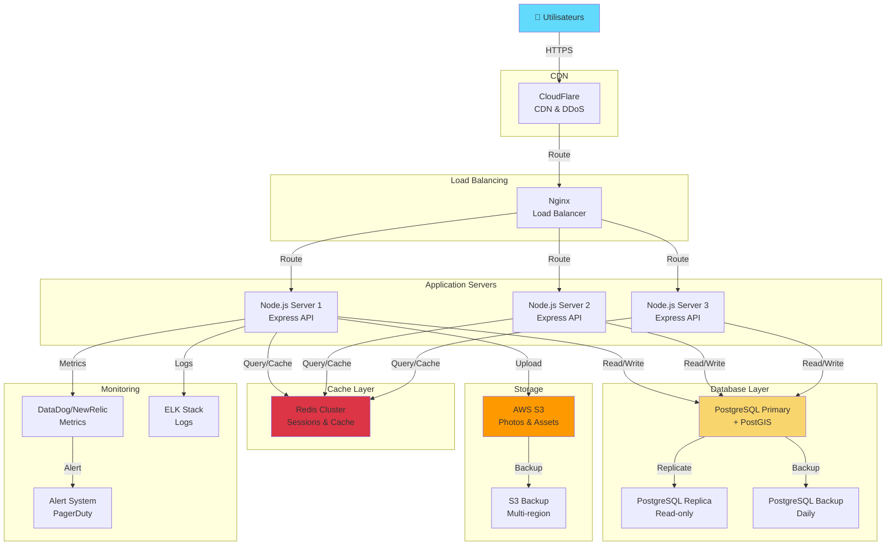

---

## 🔄 Flux de Déploiement CI/CD

```mermaid
graph LR
    Dev["👨‍💻 Developer<br/>Push Code"]
    Git["GitHub<br/>Repository"]
    CI["GitHub Actions<br/>CI Pipeline"]
    
    subgraph "Testing"
        Unit["Unit Tests"]
        Integration["Integration Tests"]
        Lint["Linting"]
    end
    
    Build["Docker Build<br/>Container"]
    Registry["Docker Registry<br/>Docker Hub"]
    
    Dev -->|git push| Git
    Git -->|webhook| CI
    CI -->|Run| Unit
    CI -->|Run| Integration
    CI -->|Run| Lint
    
    Unit -->|✓ Pass| Build
    Integration -->|✓ Pass| Build
    Build -->|Push| Registry
    
    Registry -->|Pull| Staging["Deploy to<br/>Staging"]
    Staging -->|Smoke Tests| Prod["Deploy to<br/>Production"]
    
    style Dev fill:#61dafb
    style Git fill:#24292e
    style CI fill:#4ecdc4
    style Prod fill:#ff6b6b
```

---

## 📚 Résumé des Entités et Relations

```
Total: 12 tables principales

Core:
  ├─ users (≈10,000-100,000)
  ├─ communes (≈19)
  └─ quartiers (≈150-200)

Signalement:
  ├─ signalements (≈1,000-10,000)
  ├─ signalement_photos (≈5,000-50,000)
  ├─ votes (≈10,000-100,000)
  ├─ commentaires (≈2,000-20,000)
  └─ evenement_participants

Action:
  └─ actions (≈500-2,000)

Community:
  ├─ evenements (≈100-500)
  └─ evenement_participants (≈500-5,000)

Analytics:
  └─ analytics_data (≈100,000+ dans le temps)
```

---

## ✅ Checklist d'implémentation

### Phase 1: Core
- [ ] Schema PostgreSQL
- [ ] Authentification & Autorisation
- [ ] CRUD Utilisateurs
- [ ] CRUD Communes/Quartiers

### Phase 2: Signalement
- [ ] Créer signalements
- [ ] Upload photos
- [ ] Système de vote
- [ ] Modération
- [ ] Commentaires

### Phase 3: Actions
- [ ] Créer actions
- [ ] Tracking progression
- [ ] Notifications

### Phase 4: Analytics
- [ ] Dashboard analytiques
- [ ] Génération rapports
- [ ] Export de données

### Phase 5: Mobile
- [ ] App React Native
- [ ] Push notifications
- [ ] Offline support

---

## 📖 Documentation Additionnelle

Pour plus d'informations, consultez:
- [Schema SQL détaillé](./schema.sql)
- [Documentation API Google Drive]
- [Frontend Architecture](./frontend/)
- [Documentation Mobile](./mobile/)

---

**Dernière mise à jour:** 12 mai 2026
**Statut:** ✅ Documentation complète
**Version:** 1.0.0
